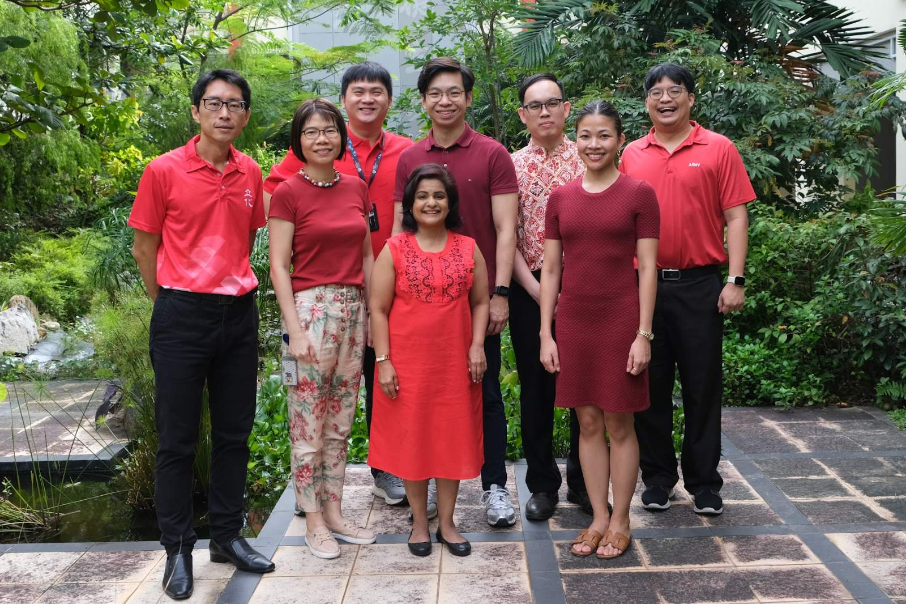

# Get Help
{: .no_toc }

Who do I ask, and how do I get a reference or transcript?
{: .fs-6 .fw-300 }

*The ECG team, 2025*

<!-- EDITOR: placeholder (Jan 2025 team photo). Replace with a current team photo, same 3:2 crop, and update the caption. -->

## Book a session
{: #book-a-session }

Not sure what to study, where to apply, or how to write your personal statement? Book a one-to-one session with our **ECG Counsellor**. Let's figure it out together.

[Book an appointment](https://cal.gov.sg/9zgk9xx0kprksz9c6dj0hlo2){: .btn .btn-primary }

## Drop in to the ECG Room

The ECG Room is open on school days. Drop by for a quick chat with the ECG Counsellor or an ECG teacher, or browse on your own. It has local and overseas university prospectuses, scholarship brochures, MBTI reading, and games and activities for exploring your interests.

You'll find it beside the Eco-trail, opposite the bookshop.

## Ask a question

For anything else, send us a message and the right teacher will get back to you.

[Send us a question](https://docs.google.com/forms/d/e/1FAIpQLSeOE8cXBpMHC2tbjBdEsutPvv78ClxrqpQtn8lb81KaPvbzGQ/viewform){: .btn }

## Who to ask & school documents

This table is the single source of "who handles what". Other pages link to its rows, so when a person changes, update the row here once.

| Destination or topic | What they help with | Who |
|---|---|---|
| Not sure where to start | Course and career decisions, personal statements, CVs, mock interviews | ECG Counsellor |
| Local universities | NUS, SMU, SUSS, University of the Arts Singapore | Local universities teacher (NUS/SMU/SUSS/UAS): Mr Alex Chan, [chan_hui_yang@moe.edu.sg](mailto:chan_hui_yang@moe.edu.sg) |
| Local universities | NTU, SUTD, SIT | Local universities teacher (NTU/SUTD/SIT): Mr Alex Chan, [chan_hui_yang@moe.edu.sg](mailto:chan_hui_yang@moe.edu.sg) |
| Scholarships and financial aid | Choosing and applying for scholarships; financial worries | Senior HOD (Talent Development, Scholarships & ECG): Ms Chitra Jenardhanan, [chitra_jenardhanan@moe.edu.sg](mailto:chitra_jenardhanan@moe.edu.sg) Scholarships teachers: Ms Rachel Tan, [tan_mann_kia_rachel@moe.edu.sg](mailto:tan_mann_kia_rachel@moe.edu.sg); Mr Sean Tan, [tan_yong_yi@moe.edu.sg](mailto:tan_yong_yi@moe.edu.sg) |
| United Kingdom | UCAS applications and references | UK universities teacher: Mr Reuben Ng, [ng_liang_zheng_reuben@moe.edu.sg](mailto:ng_liang_zheng_reuben@moe.edu.sg) |
| United States | Common App, counselor letter, school report | Subject Head (ECG): Ms Rachel Tan, [tan_mann_kia_rachel@moe.edu.sg](mailto:tan_mann_kia_rachel@moe.edu.sg) |
| China | Applications and interview practice | Chinese universities teacher: Mr Randall Hoon, [hoon_yao_tong_randall@moe.edu.sg](mailto:hoon_yao_tong_randall@moe.edu.sg) |
| Internships | Internship queries and approvals | Senior HOD (Talent Development, Scholarships & ECG): Ms Chitra Jenardhanan, [chitra_jenardhanan@moe.edu.sg](mailto:chitra_jenardhanan@moe.edu.sg) Internships teacher: Mr Sean Tan, [tan_yong_yi@moe.edu.sg](mailto:tan_yong_yi@moe.edu.sg) |
| Programmes | Horizon Programme, Sec 4 ECG Experience | Horizon & Sec 4 ECG teacher: Ms Joni Liamzon, [liamzon_joni_jeb_labio@moe.edu.sg](mailto:liamzon_joni_jeb_labio@moe.edu.sg) Horizon Programme: Ms Rachel Tan, [tan_mann_kia_rachel@moe.edu.sg](mailto:tan_mann_kia_rachel@moe.edu.sg) |
| Any | Transcripts | Your Civics Tutor |
| Any | School Graduation Certificate (SGC) testimonial: asking for a correction; certified true copies for overseas applications. Ask for a correction within 3 weeks of the SGC's issue date | Your Civics Tutor (corrections are checked by the SGC coordinators) |
| Any | Recommendation letters | Your Civics Tutor, a CCA teacher-in-charge, or a subject tutor who teaches a subject related to the course you're applying for |

Ask at least four to six weeks before the university's deadline, so your teacher has time to write or prepare what you need.

Contact any of us through the [question form](https://docs.google.com/forms/d/e/1FAIpQLSeOE8cXBpMHC2tbjBdEsutPvv78ClxrqpQtn8lb81KaPvbzGQ/viewform).

TODO: names follow the 2025 ECG Committee Deployment (NTU/SUTD/SIT moved to Mr Alex Chan, Oct 2026); check them against the 2026/27 deployment and update. Add the ECG Counsellor's name if the team wants it. Check that the SGC correction window (3 weeks, from the 2025 results-day briefing) is still current.
{: .ecg-todo }

{: .note }
> If a row's hidden label (for example ``) is changed, links from other pages will stop pointing to it. Keep the labels as they are.
