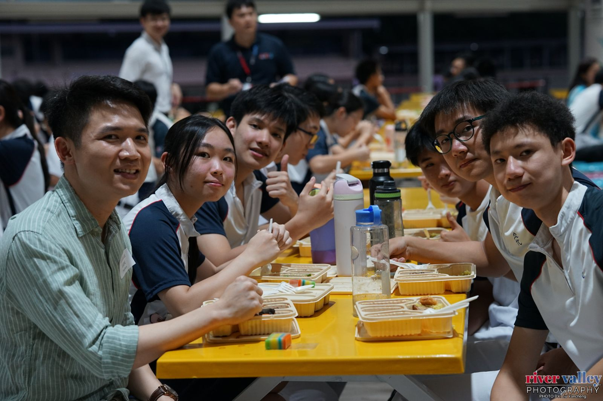
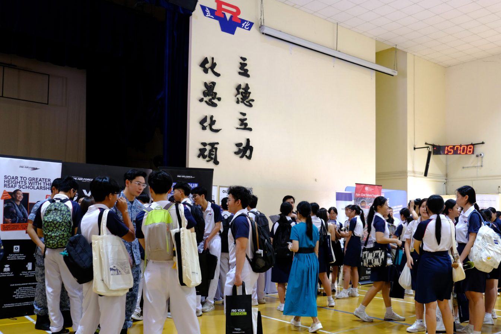

# Programmes
{: .no_toc }

What are Sec 4 ECG Experience, Gap Exploration Month, HECGS Day and Horizon, and when?
{: .fs-6 .fw-300 }

| Programme | Who | When |
|---|---|---|
| [Sec 4 ECG Experience](#sec-4-ecg-experience) | All Sec 4 | May (2 days) |
| [Gap Exploration Month](#jc1-gap-exploration-month) | JC1 IP students | January (1 month) |
| [HECGS Day](#jc1--jc2-hecgs-day) | All JC1 and JC2 | April (1 day) |
| [Horizon Programme](#horizon-programme) | JC1, by application | Apply in July |

## Sec 4 ECG Experience

{: loading="lazy"}
*Fireside chat, Sec 4 ECG Experience, May 2025*

Two days to find out what kinds of work might suit you, and to hear from the people who do them. It runs in May, in the week after mid-year exams.

**MBTI workshop.** You complete the **Myers-Briggs Type Indicator (MBTI)** online beforehand. At the workshop you receive your full profile report and take part in group activities on how your preferences show up in the way you communicate, study and handle stress.

Your type describes what you naturally prefer, not what you're able to do, and there are no right or wrong types. It can't choose a career for you, but it gives you useful words for understanding yourself and working well with people who differ from you.

**Fireside chats.** Over dinner, you sit in a group of six to eight students with two guests: working professionals or current university students. Ask them what they studied, what led them to their careers and what a typical day is like. You don't choose your guests: the point is to practise talking to people you haven't met and to hear about careers you might not have considered.

**On the day you don't have your workshop**, you explore careers and try the profiling tools in the World of Work section of [MySkillsFuture for Students](https://www.myskillsfuture.gov.sg/content/student/en/myskillsfuture-for-students.html). On the last day, you have time to record what you learnt in your ECG e-portfolio.

[Click here for details](https://sites.google.com/moe.edu.sg/sec4ecgexperience/home){: .btn .btn-primary aria-label="Click here for details: Sec 4 ECG Experience site" }

## JC1 Gap Exploration Month

*Purposeful explorers, confident navigators.*

In January, before JC lessons begin, JC1 IP students spend a month learning outside the classroom. Each student puts together their own month from four kinds of experience:

- **Internships** with organisations such as schools, preschools, clinics, social service agencies, science centres and start-ups
- **Entrepreneurship**: testing a small business idea of their own
- **Values in Action**: community projects, from community gardening to working with migrant workers
- **Online learning**: a course in something they're curious about, from neurobiology to a new language

The aim is to try things out, notice what you learn about yourself, and start JC1 with a clearer sense of direction. Record your reflections in your ECG e-portfolio: they're useful later for personal statements and interviews.

[Click here for details](https://sites.google.com/moe.edu.sg/gap2026/home){: .btn .btn-primary aria-label="Click here for details: Gap Exploration Month site" }

## JC1 & JC2 HECGS Day

{: loading="lazy"}
*HECGS Day fair, April 2025*

**Higher Education, Career Guidance and Scholarships (HECGS) Day** is a full school day, usually in April, for the whole JC1 and JC2 cohort. Universities, scholarship providers and other organisations come to RVHS, and some of their speakers are RV alumni.

**What happens on the day:**
- **Opening panel** in the auditorium, on a question about the future of study and work
- **Talks** by universities and organisations, each with time for questions. JC2s attend more talks than JC1s, because they apply to university the following year.
- **An ECG lesson** with your class
- **The ECG Fair** in the hall, where universities and organisations run booths you can visit

**Making the most of it:**
- Before the day, look through the list of talks and booths, and note two or three questions to ask.
- Ask speakers about what the course or job is really like, not only what the brochure says.
- Afterwards, write a few lines in your ECG e-portfolio about what surprised you and what you want to look into next.

[Click here for details](https://sites.google.com/moe.edu.sg/rvhs-hecgs-day/event-day){: .btn .btn-primary aria-label="Click here for details: HECGS Day site" }

## Horizon Programme

*Broaden your horizons through authentic, experiential learning.*

Horizon connects JC1 students with experienced professionals from a range of industries, to show them the world beyond the classroom. It began in 2022 with the support of a distinguished alumnus who wanted to give back to RVHS.

**What to expect:** networking workshops and sessions with professionals, company and school visits, university tours, cultural immersion, and an overseas experiential learning programme (OELP) that looks in depth at a neighbouring country.

**Who it's for:** JC1 students who are curious, proactive and keen to learn from others; passionate about academic or non-academic pursuits; grateful at heart; and with a conduct grade of at least *Very Good*.

{: .note }
> Students selected for Horizon take part in its overseas programme rather than other school overseas trips, so that as many students as possible get a meaningful international experience. Exceptions may be made in special cases.

{: .deadline }
> **Next intake (2027–28):** applications usually open in July. (The 2026–27 intake applied 16–22 Jul 2026; only shortlisted candidates were invited to a group interview.)
